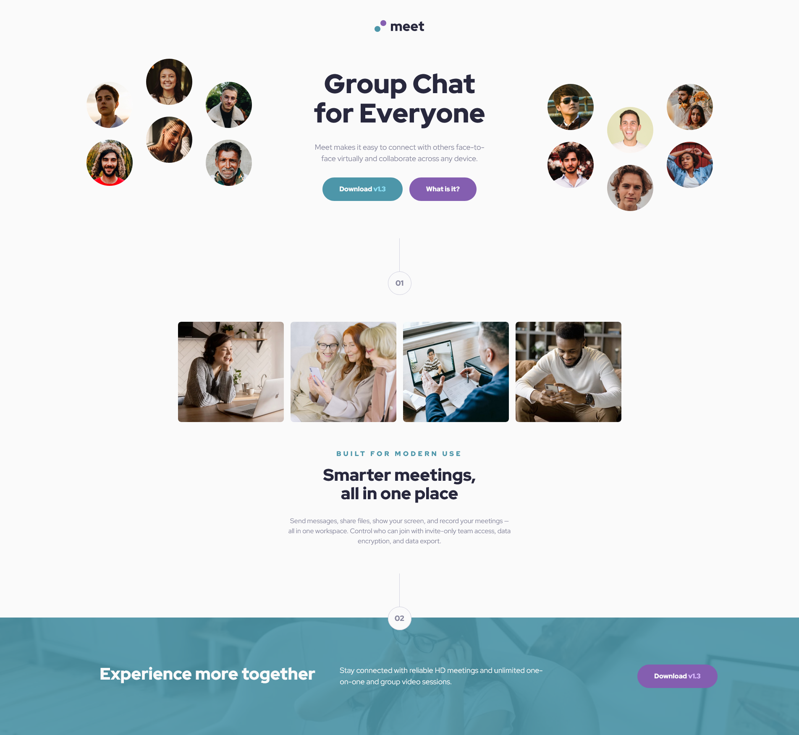

# Frontend Mentor - Meet landing page solution

This is a solution to the [Meet landing page challenge on Frontend Mentor](https://www.frontendmentor.io/challenges/meet-landing-page-rbTDS6OUR). Frontend Mentor challenges help you improve your coding skills by building realistic projects. 

## Table of contents

- [Overview](#overview)
  - [The challenge](#the-challenge)
  - [Screenshot](#screenshot)
  - [Links](#links)
- [My process](#my-process)
  - [Built with](#built-with)
  - [What I learned](#what-i-learned)
  - [Useful resources](#useful-resources)
- [Author](#author)

## Overview

  This projects tests your ability to create responsive layouts. It allows you use everything that you have learned from HTML, CSS and responsive design.

### The challenge

Users should be able to:

- View the optimal layout depending on their device's screen size
- See hover states for interactive elements

### Screenshot



### Links

- Solution URL: [https://www.frontendmentor.io/solutions/responsive-meet-landing-page-using-bem-and-sass-4-thkNjftF](https://www.frontendmentor.io/solutions/responsive-meet-landing-page-using-bem-and-sass-4-thkNjftF)
- Live Site URL: [https://schindlerdumagat.github.io/meet-landing-page/src/](https://schindlerdumagat.github.io/meet-landing-page/src/)

## My process

Here is my approach to this project:

  1. I opened the figma file for this project and view the design. I checked the design from top to bottom and look for reusable components that I can build. I checked the design system for the required colors, fonts, spacing, etc. I also checked for interactive elements in the design.
  2. I created a github repository to push my initial commit.
  3. I imported the needed font from the google fonts website to my html head tag. Then, I setup my folder structure to organize my codebase.
  4. I created my sass variables for my fonts, colors, spacing and other needed variables so that I can reuse them later on. I also create reusable styles for both the buttons and numbers.
  5. I started doing the html markup for this project.
  6. I started styling each sections of the page from top to bottom until I meet the design requirements.
  7. I validated my solution by comparing it to the design file. I also checked for its responsiveness in all screen sizes.
  8. I pushed it to my github and created a github page for my solution and show it to others.

### Built with

- Semantic HTML5 markup
- CSS
- Flexbox
- CSS Grid
- Mobile-first workflow
- [Sass](https://sass-lang.com/) - CSS Preprocessor
- [BEM](https://getbem.com/) - Block Element Modifier

### What I learned

By building this project, I was able to reinforce my knowledge about HTML and CSS. I was able to use a lot of CSS properties and enhanced my knowledge on them. I gained some confidence on how I can handle images in a website. I practiced my responsive layouting skills with the use of media queries, flexbox and css grid and reinforced my knowledge on them. I learned how to structure my codebase in a way that is easy to maintain and follow. I learned how to tokenized my styles using variables and use it thoughout my project. I learned how to create reusable styles like the ones I implement for the buttons in this project.

Here are some of my variables:

```scss
// Fonts

$ff-main: "Red Hat Display", serif;
$fs-h1: clamp(2.5rem, 1rem + 4.16666vw, 4rem);
$fs-h2: clamp(2rem, 1rem + 2.60416vw, 2.5rem);
$fs-body: clamp(1rem, 0.5rem + 1vw, 1.125rem);
$fs-subtitle: clamp(0.75rem, 0.5rem + 0.78125vw, 1rem);
$fs-button: 1rem;

// Colors

$cyan-600: #4D96A9;
$cyan-300: #8FE3F9;
$cyan-hover: #71C0D4;
$purple-600: #845eb0;
$purple-300: #D9B8FF;
$purple-hover: #b28cde;
$slate-900: #28283D;
$slate-600: #87879D;
$slate-300: #D1D1DF;
$white: #FAFAFA;

$space-50: 0.25rem;
$space-100: 0.5rem;
$space-200: 1rem;
$space-300: 1.5rem;
$space-400: 2rem;
$space-500: 2.5rem;
$space-600: 3rem;
$space-700: 3.5rem;
$space-800: 4rem;
$space-900: 4.5rem;
$space-1000: 5rem;
$space-1400: 7rem;
```

Sample reusable style for buttons:

```scss
@mixin button($bgColor: $white) {
    font-size: $fs-button;
    font-weight: 900;
    background-color: $bgColor;
    color: $white;
    border: transparent;
    border-radius: 999px;
    padding: 1rem 2.5rem;
    transition: 300ms;
    text-decoration: none;
    outline: inherit;
    cursor: pointer;

    @if $bgColor == $cyan-600 {
        & > .version {
            color: $cyan-300;
        }

        &:is(:hover, :active, :focus) {
            background-color: $cyan-hover;
        }
    } @else if $bgColor == $purple-600 {
        & > .version {
            color: $purple-300;
        }
        &:is(:hover, :active, :focus) {
            background-color: $purple-hover;
        }
    }
}
```

### Useful resources

- [Web.Dev - Responsive Design](https://web.dev/learn/design) - This help me grab the basics of responsive design.
- [Web.Dev - CSS](https://web.dev/learn/css) - This gave me the basics of flexbox and grid and apply it to this project.

## Author

- Website - [Schinder C. Dumagat](https://schindlerdumagat.github.io/webportfolio/)
- Frontend Mentor - [@schindlerdumagat](https://www.frontendmentor.io/profile/schindlerdumagat)
- LinkedIn - [@schindler_linkedIn](https://www.linkedin.com/in/schindler-dumagat-015238230/)
